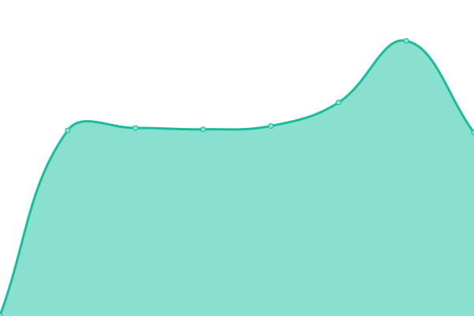

# [📈 Live Status](https://status.savageservices.com): <!--live status--> **🟧 Partial outage**

This repository contains the open-source uptime monitor and status page for [SavageServices](https://status.savageservices.com), powered by [Upptime](https://github.com/upptime/upptime).

With [Upptime](https://upptime.js.org), you can get your own unlimited and free uptime monitor and status page, powered entirely by a GitHub repository. We use [Issues](https://github.com/SavageServices/status/issues) as incident reports, [Actions](https://github.com/SavageServices/status/actions) as uptime monitors, and [Pages](https://status.savageservices.com) for the status page.

<!--start: status pages-->
<!-- This summary is generated by Upptime (https://github.com/upptime/upptime) -->
<!-- Do not edit this manually, your changes will be overwritten -->
<!-- prettier-ignore -->
| URL | Status | History | Response Time | Uptime |
| --- | ------ | ------- | ------------- | ------ |
|  [AccountingPortal](https://accounting.savageservices.com/accountingPortal/) | 🟩 Up | [accounting-portal.yml](https://github.com/SavageServices/status/commits/HEAD/history/accounting-portal.yml) | 

 1214ms
     
 | 

<a href="https://status.savageservices.com/history/accounting-portal">100.00%</a>
    

|  [Archiver](https://archiver.savageservices.com/) | 🟩 Up | [archiver.yml](https://github.com/SavageServices/status/commits/HEAD/history/archiver.yml) | 

 393ms
     
 | 

<a href="https://status.savageservices.com/history/archiver">100.00%</a>
    

|  [Connect](https://connect.savageservices.com) | 🟩 Up | [connect.yml](https://github.com/SavageServices/status/commits/HEAD/history/connect.yml) | 

 308ms
     
 | 

<a href="https://status.savageservices.com/history/connect">100.00%</a>
    

|  [Input](https://input.savageservices.com) | 🟩 Up | [input.yml](https://github.com/SavageServices/status/commits/HEAD/history/input.yml) | 

 1095ms
     
 | 

<a href="https://status.savageservices.com/history/input">100.00%</a>
    

|  [S7i](https://s7i.savageservices.com) | 🟩 Up | [s7i.yml](https://github.com/SavageServices/status/commits/HEAD/history/s7i.yml) | 

 295ms
     
 | 

<a href="https://status.savageservices.com/history/s7i">100.00%</a>
    

|  [Snapshot](https://snapshot.savageservices.com) | 🟩 Up | [snapshot.yml](https://github.com/SavageServices/status/commits/HEAD/history/snapshot.yml) | 

 324ms
     
 | 

<a href="https://status.savageservices.com/history/snapshot">100.00%</a>
    

|  [TheHub](https://thehub.savageservices.com) | 🟩 Up | [the-hub.yml](https://github.com/SavageServices/status/commits/HEAD/history/the-hub.yml) | 

 677ms
     
 | 

<a href="https://status.savageservices.com/history/the-hub">100.00%</a>
    

|  [TheHub2](https://thehub2.savageservices.com) | 🟥 Down | [the-hub2.yml](https://github.com/SavageServices/status/commits/HEAD/history/the-hub2.yml) | 

 806ms
     
 | 

<a href="https://status.savageservices.com/history/the-hub2">100.00%</a>
    

|  [Trainloading](https://trainloading.savageservices.com/train-loading/train/) | 🟩 Up | [trainloading.yml](https://github.com/SavageServices/status/commits/HEAD/history/trainloading.yml) | 

 281ms
     
 | 

<a href="https://status.savageservices.com/history/trainloading">100.00%</a>
    

|  [Transload](https://transload.savageservices.com) | 🟩 Up | [transload.yml](https://github.com/SavageServices/status/commits/HEAD/history/transload.yml) | 

 284ms
     
 | 

<a href="https://status.savageservices.com/history/transload">100.00%</a>
    

<!--end: status pages-->

[**Visit our status website →**](https://status.savageservices.com)

## 📄 License

- Powered by: [Upptime](https://github.com/upptime/upptime)
- Code: [MIT](./LICENSE) © [SavageServices](https://status.savageservices.com)
- Data in the `./history` directory: [Open Database License](https://opendatacommons.org/licenses/odbl/1-0/)
